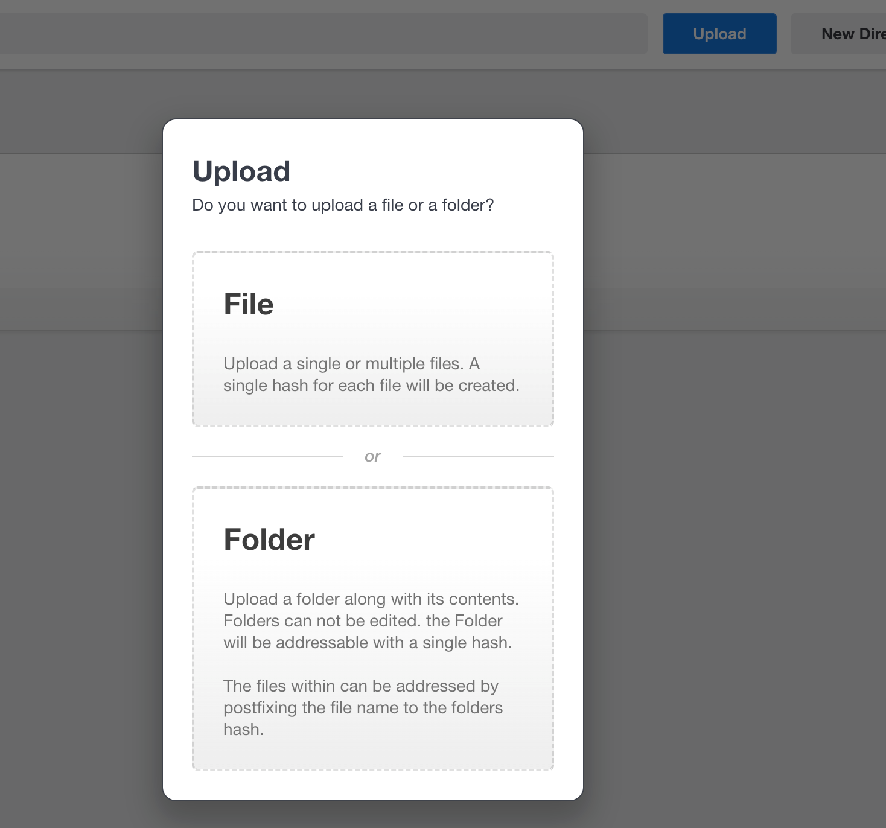

# Uploads Overview

From your Dashboard click the blue Upload button.&#x20;

Here you will see for the first time, the option to upload a Folder and as noted in the interface, you will be reminded of the options. The primary distinction is in how the files are stored on the dStor network.&#x20;

### <mark style="color:purple;">Note:</mark> Distinguish between Directories and Folders

_Directories_ are a tool for portal users to organize files. Using a directory has no impact on file hashes and serve only to help users visually organize files in the portal. When full functionality is released, users will be able to move files between directories.

When using dStor, the term _Folder_ refers to a _**hashed folder**_ containing files. In this use case, the entire folder is hashed, so neither the contents nor the folder itself can be edited in any way.

<figure><figcaption></figcaption></figure>

